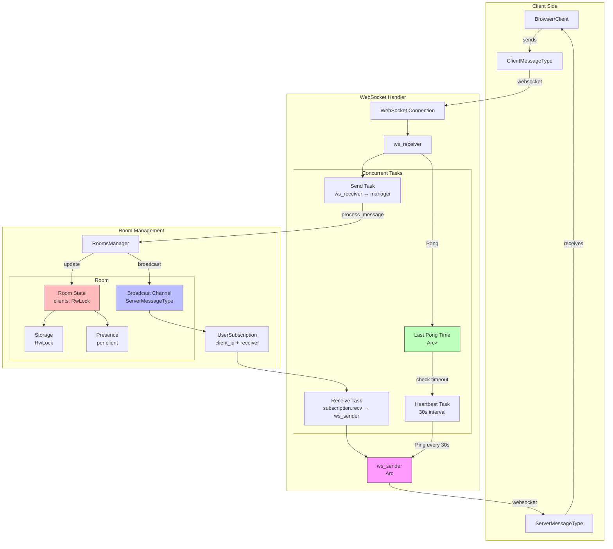

# WebSocket-Based Room Management System Architecture

## Overview
Our system implements a real-time room management solution using WebSocket connections, with support for presence tracking and persistent storage. The architecture follows a broadcast-based pattern where messages flow bidirectionally between clients and the server through dedicated channels.

## Message Types
We have two primary message types that flow through the system:

```rust
#[derive(Debug, Serialize, Deserialize)]
pub enum ClientMessageType {
    UpdatePresence(Presence::Update),
    UpdateStorage(Storage::Operation),
    JoinRoom(RoomId),
    LeaveRoom,
}

#[derive(Debug, Serialize, Deserialize)]
pub enum ServerMessageType<RoomId, ClientId, P, S> {
    RoomJoined {
        room_id: RoomId,
        client_id: ClientId,
    },
    RoomLeft {
        room_id: RoomId,
        client_id: ClientId,
    },
    PresenceUpdated {
        client_id: ClientId,
        timestamp: DateTime<Utc>,
        presence: P,
    },
    StorageUpdated {
        version: u64,
        operations: Vec<S::Operation>,
    },
    Ping,
}
```

## Core Components

### 1. Room Manager
The `RoomsManager` is the central coordinator that handles room creation, client management, and message distribution:

```rust
pub struct RoomsManager {
    rooms: RwLock<HashMap<RoomId, Arc<Room>>>,
}

impl RoomsManager {
    pub async fn ensure_room(&self, room_id: RoomId) -> Arc<Room> {
        let rooms = self.rooms.read().await;
        if let Some(room) = rooms.get(&room_id) {
            room.clone()
        } else {
            drop(rooms);
            let mut rooms = self.rooms.write().await;
            let room = Arc::new(Room::new(room_id));
            rooms.insert(room_id, room.clone());
            room
        }
    }
}
```

### 2. Room State
Each room maintains its own state, including connected clients and a broadcast channel:

```rust
pub struct Room {
    room_id: RoomId,
    clients: RwLock<HashMap<ClientId, ClientState>>,
    sender: broadcast::Sender<ServerMessageType>,
    storage: RwLock<Box<dyn StorageLike>>,
}

pub struct ClientState {
    forwarder: ClientForwarder,
    presence: Box<dyn PresenceLike>,
    last_seen: DateTime<Utc>,
    connection_info: ConnectionInfo,
    permissions: ClientPermissions,
}
```
